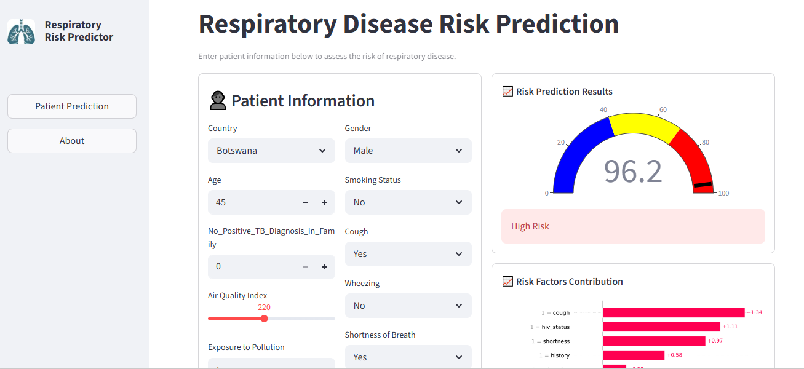

# 🫁 Respiratory Disease Risk Prediction

## 📌 Project Overview

The Respiratory Disease Risk Prediction System is a machine learning application designed to predict the likelihood of Respiratory Disease using patient clinical characteristics and environmental air quality indicators.

The project demonstrates an end-to-end machine learning workflow, from data preprocessing and exploratory data analysis to model development, evaluation, explainability, and deployment using Streamlit.

---

## 🎯 Objectives

- Predict the risk of Respiratory Disease in patients using synthetic Tuberculosis (TB) dataset .
- Merge TB sythetic data with air quality data
- Identify the most influential risk factors affecting predictions.
- Provide interpretable predictions using SHAP.
- Deploy an interactive web application for end users.

---

## 📊 Dataset

This project combines multiple data sources, including:

- Synthetic respiratory patient dataset
- Air quality dataset (Sentinel-5P)

### Patient Features

- Age
- Gender
- Smoking Status
- Exposure to pollution
- HIV Diagnosis
- Previous Respiratory Illness
- Country
- Cough
- Wheezing
- Shortness of breath
- Air Quality Index (AQI)
- No_Positive_TB_Diagnosis_in_Family

Target Variable:

- **TB Diagnosis**

---

## 🛠 Data Preprocessing

The following preprocessing steps were applied:

- Missing value imputation
- Duplicate removal
- Feature engineering
- Air Quality Index generation
- Categorical encoding
- Handling class imbalance

---

## 🤖 Machine Learning Models

Three supervised learning models were trained and evaluated:

- Random Forest
- XGBoost
- LightGBM

Because the dataset was imbalanced, class weighting techniques were applied to improve minority class detection.

---

## 📈 Evaluation Metrics

Models were evaluated using:

- Precision
- Recall
- F1 Score
- ROC-AUC
- Balanced Accuracy
- Confusion Matrix

LightGBM wasa the best-performing model ant was selected for deployment.

---

## 🔍 Model Explainability

SHAP (SHapley Additive Explanations) was used to explain individual predictions and understand feature importance.

The deployed application provides prediction explanations to improve model transparency.

---

## 💻 Streamlit Application

The application includes:

### 🏥 Patient Prediction

Predicts an individual's risk of Respiratory based on patient information.

### 📊 Prediction Explanation

Displays SHAP explanations showing how each feature influenced the prediction.

### ℹ️ About

Provides project information, methodology, and model details.

---

## 📁 Project Structure

```
Respiratory-Disease-Prediction/
│
├── Datasets/
│   ├── Royalwood_Cancer_Center_Synthetic_Respiratory_Data.csv
│   └── SouthernAfrica_Sentinel5P.csv
│
├── images/
│   ├── shot.PNG
│   └── logo.JFIF
├── models/
│   ├── best_model.pkl
│   └── shap_explainer.pkl
│
├── app.py
├── Respiratory_disease_prediction.ipynb
├── logo.jfif
├── README.md
└── requirements.txt
```

---

## 🚀 Installation

Clone the repository

```bash
git clone https://github.com/Puseletso10/Respiratory-Disease-Prediction.git
```

Navigate to the project folder

```bash
cd Respiratory-Disease-Prediction
```

Install dependencies

```bash
pip install -r requirements.txt
```

Run the application

```bash
streamlit run app.py
```

---

## 📦 Technologies Used

- Python
- Pandas
- NumPy
- Scikit-learn
- LightGBM
- XGBoost
- SHAP
- Plotly
- Matplotlib
- Streamlit
- Joblib

---

## 📷 Application Preview

  

---

## 👤 Author

**Puseletso Motsoari**

- LinkedIn: https://www.linkedin.com/in/puseletso-motsoari
- GitHub: https://github.com/Puseletso10

---

## 📄 License

This project is intended for educational and research purposes.
